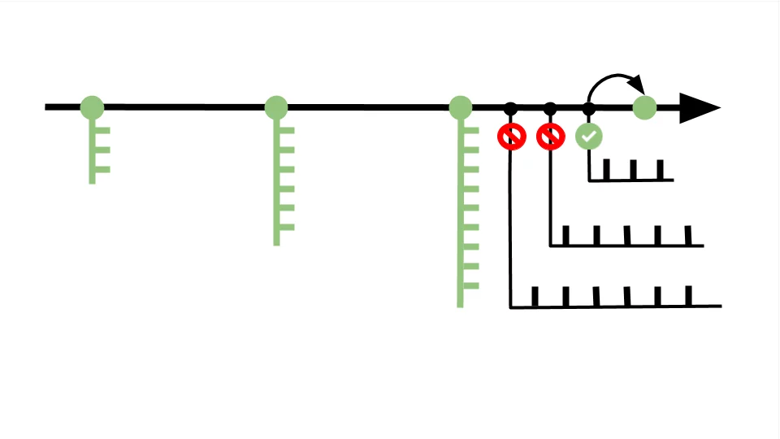

Git is a system for managing the source code versions of programs. In the article we will get acquainted with its main features, show the difference from GitHub and explain why Git is for a beginner. You will also learn where to start learning and why it is not worth wasting time on alternative programs.

#Git is a commit system

Imagine the situation: a gamer reaches the final, loses and returns to the beginning of the level — gets to the nearest control point of the game, where the developers allowed to be saved. If we remove the checkpoints, after each loss we will have to start the game again.

> In programming, the version control system is responsible for saving code at checkpoints — a special technology that can be connected to any project. The version control system insures against errors and returns the code to the state when everything worked.

Checkpoints are called commits. A single commit is a package of changes that stores information with added, edited, or deleted code files. It is customary to add no more than ten changes to one commit — this is how a long version history turns out, which allows you to roll back in case of an error with minimal loss of workable code.

#Git is a complex of related branches

Commits are located on the master branch - the main version of the project, which will turn into a product after completion.

> The version control system allows you to create branches from the master branch and experiment with the project without interfering with other team members.

Let's take the previous scheme, where we found an error and rolled back one commit. To fix the code, we will create several additional branches and test different solutions to the problem in each one. When a solution is found, we transfer the branch with the correct code to the master branch and save the commit. We leave or delete the extra branches, because they do not affect the project and are hidden from other developers — this is your personal draft.

#Git is a collaborative code creation tool

It often happens like this: developers separate from the master branch and work on part of the project on their own - for example, to test additional functions. But they can't continue until someone from the team completes the code.

> The version control system allows you not to wait for the master branch to be updated and allows all team members to move freely between the branches of other developers to copy the necessary code fragments.

There are also reverse situations when several developers simultaneously add code, upload it to the master branch and face a conflict - one file receives several inconsistent changes. In this case, Git will try to fix the errors automatically. If it doesn't work out, the developers will see it and will be able to correct the code manually.

