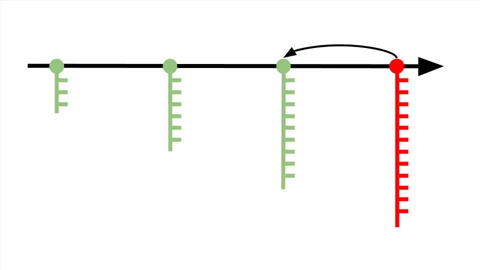
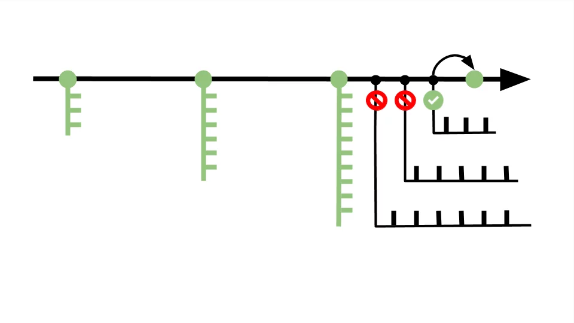

Git — это система для управления версиями исходного кода программ. В статье мы познакомимся с её основными возможностями, покажем отличие от GitHub и объясним, зачем Git новичку. Ещё вы узнаете, с чего начать обучение и почему не стоит тратить время на альтернативные программы.

#  Git — это система коммитов

Представьте ситуацию: геймер доходит до финала, проигрывает и возвращается к началу уровня — попадает в ближайшую контрольную точку игры, где разработчики разрешили сохраниться. Если мы уберём контрольные точки, после каждого проигрыша придётся начинать игру заново.

> В программировании за сохранение кода в контрольных точках отвечает система контроля версий — специальная технология, которую можно подключить к любому проекту. Система контроля версий страхует от ошибок и возвращает код в то состояние, когда всё работало.

Контрольные точки называются коммитами. Один коммит — это пакет изменений, хранящий информацию с добавленными, отредактированными или удалёнными файлами кода. В один коммит принято добавлять не более десяти изменений — так получается длинная история версий, которая позволяет в случае ошибки откатиться с минимальной потерей работоспособного кода.

# Git — это комплекс связанных веток

Коммиты располагаются на master-ветке — основной версии проекта, которая после завершения работы превратится в продукт.

> Система контроля версий позволяет создавать ответвления от master-ветки и экспериментировать с проектом, не мешая другим участника команды. 

Возьмём предыдущую схему, где мы обнаружили ошибку и откатились на один коммит назад. Чтобы поправить код, создадим несколько дополнительных веток и в каждой протестируем разные варианты решения проблемы. Когда решение найдено, ветку с правильным кодом переносим в master-ветку и сохраняем коммит. Лишние ветки оставляем или удаляем, поскольку они не влияют на проект и скрыты от других разработчиков — это ваш личный черновик.

# Git — это инструмент совместного создания кода

Часто бывает так: разработчики отделяются от master-ветки и работают над частью проекта самостоятельно — например, чтобы протестировать дополнительные функции. Но не могут продолжить, пока кто-то из команды не допишет код.

> Система контроля версий позволяет не ждать обновления master-ветки и разрешает всем участникам команды свободно перемещаться между ветками других разработчиков для копирования нужных фрагментов кода.

Бывают и обратные ситуации, когда несколько разработчиков одновременно дописывают код, заливают его в master-ветку и сталкиваются с конфликтом — один файл получает несколько несогласованных изменений. В этом случае Git попробует автоматически исправить ошибки. Если не получится, разработчики это увидят и смогут поправить код вручную.

